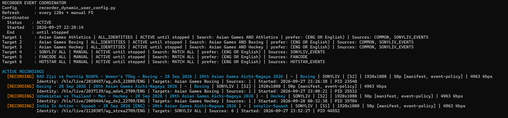
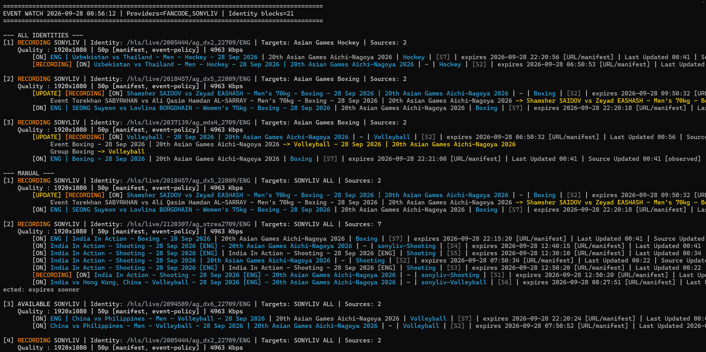

# Recorder — Inspect · Watch · Record · Auto

[](https://github.com/sumitdipsite2005/Recorder/actions/workflows/tests.yml)


**A terminal-first live-stream recording system that discovers sources, inspects their quality and usability, watches logical event identities, and launches resilient recording workers automatically or on demand.**

Recorder started as a mature dynamic recording engine. The project now adds an identity-aware **Inspect / Watch / Record / Auto** layer around that engine, turning playlist discovery into an unattended recording workflow rather than a one-shot recording command.

## Why Recorder exists

Recording a live stream sounds simple — until you need the recording to actually survive for hours unattended.

Have you ever:

- started an overnight recording, only to discover in the morning that the stream died halfway through?
- finished a long recording and realized the source had degraded, buffered, or become unusable while the event kept going?
- lost part of a recording because authorization expired, a VPN or network path changed, or the source URL stopped working while nobody was watching?

A downloader can report an error and stop. A live recorder has a harder job: **time keeps moving even when the source fails**.

Recorder was built around that problem. Its recording engine continuously treats the current stream as something that may need to be renewed, replaced, recovered, or upgraded while preserving the recording itself. It can evaluate alternative sources, react to authorization and access failures, recover from stream problems, perform controlled source changes, and keep working toward the best complete recording it can produce.

But keeping one recording alive is only half the problem.

What if you are watching several playlists or events at once? What if the same underlying feed appears through multiple sources? What if you want the right recording to start when a qualifying stream appears — without manually checking playlists all day?

That is the job of the **Coordinator**.

The Coordinator continuously **Inspect → Watch → Record → Auto**:

- it discovers and inspects available streams;
- understands when different source rows represent the same logical feed;
- watches those identities as sources appear, disappear, recover, or change;
- prevents duplicate recordings of the same feed;
- lets a user start selected recordings manually; or
- launches qualifying recordings automatically and continues watching for more.

Together, the two layers solve different parts of the same real-world problem:

**The Coordinator decides what needs attention and when recording should begin.  
The Recorder keeps that recording alive when the live-stream environment stops behaving perfectly.**

The result is not simply a command that downloads a stream. It is an unattended live-recording system designed around the reality that online sources, networks, authorization, quality, and availability can all change while the event itself continues.

## Contents

- [Inspect → Watch → Record → Auto](#inspect--watch--record--auto)
- [Identity-aware source coordination](#identity-aware-source-coordination)
- [Architecture](#architecture)
- [The recording engine — keeping a live recording alive](#the-recording-engine--keeping-a-live-recording-alive)
- [Coordinator dashboard](#coordinator-dashboard)
- [Unattended recording workflow](#unattended-recording-workflow)
- [Project structure](#project-structure)
- [Identity policies](#identity-policies)
- [Configuration](#configuration)
- [Testing and CI](#testing-and-ci)
- [Project status](#project-status)
- [What’s next](#whats-next)
- [End-user installation status](#end-user-installation-status)

## Inspect → Watch → Record → Auto

| Stage | What Recorder does |
| --- | --- |
| **Inspect** | Acquires configured playlists, matches relevant entries, resolves candidate sources, probes quality and availability, and groups equivalent feeds into canonical identities. |
| **Watch** | Continuously refreshes those identities in the Coordinator dashboard, preserving useful state while sources appear, disappear, fail probing, recover, or change quality. |
| **Record** | Launches one identity-bound worker through the mature dynamic recorder, with source selection, renewal, failover/recovery, quality upgrades, validation, logging, and finalization. |
| **Auto** | Under **ALL_IDENTITIES**, automatically starts newly eligible identities while the Coordinator continues watching for more. |

The same Coordinator can also keep targets in **MANUAL** mode, where discovered identities are visible but recording starts only when the user selects one.

## Identity-aware source coordination

Recorder separates **what is being recorded** from the individual playlist URL that happens to carry it at a particular moment.

A provider may expose several URLs for the same event or feed. Recorder derives a stable identity, groups equivalent candidates together, evaluates the available choices, and gives that identity a single worker owner. This allows the system to reason about the recording as a continuing event rather than as one fragile URL.

Key capabilities include:

- **Playlist and source discovery** across configured source groups.
- **Candidate inspection and probing** for resolution, FPS, bitrate, scan type, availability, and other source evidence where known.
- **Canonical identity derivation** so equivalent source rows can be treated as one logical feed.
- **Quality grouping** with remembered display placement when a previously known source temporarily fails probing.
- **MANUAL and ALL_IDENTITIES policies** in the same Coordinator.
- **Duplicate prevention** through a shared identity registry.
- **Automatic worker launch** for newly eligible identities.
- **20-worker shared active ceiling** across MANUAL and ALL_IDENTITIES ownership.
- **Source renewal, failover, recovery, and controlled quality upgrades** through the mature dynamic recorder.
- **Runtime status tracking** for Coordinator-launched workers.
- **Terminal controls and transient notifications** without requiring a GUI.
- **Optional refresh and launch sounds**, including snooze control.
- **Regression and safety coverage** exercised by GitHub Actions.

## Architecture

```text
Configured targets
       │
       ▼
Playlist acquisition / source discovery
       │
       ▼
Matching + probing + quality evidence
       │
       ▼
Canonical feed identity
       │
       ▼
Identity Coordinator
   ┌───────────────┐
   │ MANUAL        │  user chooses Record
   │ ALL_IDENTITIES│  eligible identities auto-launch
   └───────────────┘
       │
       ▼
Shared identity registry
       │
       ▼
Identity-bound worker
       │
       ▼
Dynamic recorder
       │
       ├─ source selection
       ├─ recording
       ├─ authorization / source renewal
       ├─ failover and recovery
       ├─ quality upgrade
       ├─ validation / alarms
       └─ finalization
```

A canonical identity can have only one active owner. The registry covers workers in **LAUNCHING**, **RECORDING**, and **WAITING_FOR_SOURCE** states, so MANUAL and automatic launches cannot accidentally create duplicate active recordings for the same identity.

## The recording engine — keeping a live recording alive

The Coordinator solves the problem of **what should be recorded and when it should start**.

Once a recording begins, the mature recording engine takes over a different problem: **keeping that recording alive while the source, network, authorization, quality, DRM, and downloader conditions continue to change.**

`record_dynamic.py` is the runtime engine behind Coordinator-launched recordings as well as the standalone dynamic recording workflow.

A typical recording is not simply:

```text
open stream
    ↓
download until finished
```

It is closer to:

```text
Inspect available sources
        ↓
Select the best usable candidate
        ↓
Start recording
        ↓
Continuously monitor recording health
        ↓
Source fails?        Authorization changes?
Quality improves?    Access path changes?
Downloader stalls?   DRM / license needs resolution?
        ↓
Renew / resolve / retry / recover / switch / upgrade
        ↓
Validate recorded media
        ↓
Continue recording
        ↓
Finalize the completed output
```

The engine already handles substantial runtime behavior, including:

- **Source selection and ranking** across available candidates.
- **Authorization lifetime handling and renewal** for sources that may expire during a long recording.
- **DRM-aware recording and ClearKey support** for supported license/key resolution and decryption workflows.
- **License and session handling** for the headers, cookies, authorization, and access context required by protected sources.
- **Failover and recovery** when the active source or downloader stops behaving correctly.
- **Controlled source rollover** so a replacement source can take over without treating the recording as a completely new job.
- **Quality upgrades** when a better eligible source becomes available.
- **Access and VPN recovery** when source availability changes because of the current network path.
- **Downloader failure and stall handling**, including retry and source-exclusion behavior.
- **Media and chunk validation** so continued downloading is not mistaken for a healthy recording.
- **Runtime alarms and controls** for conditions that require user attention.
- **Playlist-history evidence** for understanding what sources were available and how they behaved over time.
- **Recording duration, cleanup, and finalization** of the finished media.

The Coordinator does not replace this machinery. It adds discovery, identity awareness, ownership, and automation **around the same recording engine**.

Together, the two parts have distinct responsibilities:

**The Coordinator finds and manages the recordings that should exist.  
The recording engine does the difficult work of keeping each one alive.**

## Coordinator dashboard

The Coordinator is the main Inspect / Watch interface. It presents the system as a live terminal dashboard rather than a GUI.





It shows:

- **ACTIVE RECORDINGS**
- **ALL IDENTITIES** targets
- **MANUAL** targets
- canonical identities and their current state
- quality groups and candidate source rows
- working / failed probe state
- source freshness and update information
- worker / registry status
- meaningful change notifications

The dashboard also exposes runtime controls for manual recording selection, information, sound control, refresh, and exit.

## Unattended recording workflow

A typical automatic workflow is:

```text
Start Coordinator
      ↓
Watch configured event playlists
      ↓
Discover a new qualifying identity
      ↓
Inspect and rank its candidate sources
      ↓
Claim identity ownership atomically
      ↓
Launch one worker
      ↓
Record / renew / recover as required
      ↓
Continue watching for additional identities
```

If the 20-worker active ceiling is reached, remaining identities stay watched instead of being incorrectly marked as failed.

## Project structure

```text
record_dynamic.py
    Mature dynamic recording engine.

recorder_event_coordinator.py
    Inspect / Watch Coordinator and launch orchestration.

recorder_identity_worker.py
    Entry point for one identity-bound recording worker.

recorder_coordinator/
    Acquisition, configuration, launch planning, snapshots,
    dashboard presentation, and worker orchestration.

recorder_source/
    Shared discovery, manifest handling, matching, identity,
    probing, quality, transport, and source-selection logic.

recorder_runtime/
    Identity registry, worker status, runtime paths,
    launch contracts, sound state, and terminal hosting.

tests/
checkpoint0_tests/
    Regression and safety coverage.
```

## Identity policies

### MANUAL

The Coordinator discovers and displays qualifying identities, but does not start a worker until the user chooses **Record**.

This is useful for broad observation targets where visibility is desired without automatically recording everything discovered.

### ALL_IDENTITIES

Every newly eligible canonical identity is automatically launched through the same worker path used by MANUAL recording.

Multiple matching identities can appear in one scan. Recorder can launch them as capacity permits while keeping duplicate ownership and the global worker ceiling enforced centrally.

## Configuration

User-maintained runtime configuration is intentionally kept **outside this repository** in:

```text
recorder_dynamic_user_config.py
```

On the supported Windows/macOS setup, Recorder resolves the normal OneDrive Recorder configuration location automatically.

A different Coordinator config can be supplied explicitly:

```bash
python recorder_event_coordinator.py --config "/path/to/recorder_dynamic_user_config.py"
```

Start the Coordinator with the normal configuration location:

```bash
python recorder_event_coordinator.py
```

Run the standalone dynamic recorder directly:

```bash
python record_dynamic.py
```

The repository deliberately does not publish live user configuration, signed playback URLs, cookies, or local sound files.

## Optional sounds

Recorder and the Coordinator use separate optional local sound files:

```text
alarm.wav
sounds/refresh.wav
sounds/launch.wav
```

- `alarm.wav` — recording-engine alarm sound for serious runtime conditions.
- `refresh.wav` — Coordinator notification when a meaningful dashboard update is ready to inspect.
- `launch.wav` — Coordinator notification when one or more ALL_IDENTITIES workers launch successfully in a scan.

Coordinator launch notification takes priority when both Coordinator notification conditions happen in the same scan. Recorder and Coordinator sounds respect their sound-snooze controls.

These optional local sound assets are not included in the repository.

## Testing and CI

GitHub Actions runs the regression suite on pushes to `main` and `dev`, and on pull requests.

```bash
python -m unittest -v checkpoint0_tests/test_recorder_safety_baseline.py
python -m unittest discover -s tests -v
```

Windows users can also run:

```text
run_all_tests.bat
```

The test suite covers the shared source core, identity derivation, Coordinator behavior, launch planning, registry ownership, runtime status, worker launch, terminal hosting, sound behavior, and architecture boundaries.

## Branches

- **main** — stable Recorder baseline.
- **dev** — ongoing development and testing.

Development is normally validated on `dev` and promoted to `main` after the regression suite is green.

## Project status

**Inspect / Watch / Record / Auto is implemented and promoted to the stable baseline.**

Recorder already combines a mature recording engine with source discovery, quality-aware selection, recovery, controlled source changes, duplicate prevention, automatic launches, and live Coordinator monitoring.

That gives the project a stable foundation to build on.

## What’s next

The next phase extends the same foundation both technically and as a product:

- **One Recorder application** — the user chooses a source, searches for something to record, or selects a saved source; Recorder decides which capabilities are needed underneath.
- **A graphical Recorder interface** — discovery, recording, monitoring, saved sources, and controls in one application rather than primarily through terminal workflows.
- **Fresh playback sessions and Widevine support** — reduce manual handling of short-lived manifests, cookies, headers, and authorization while adding authorized Widevine/CDM support where required.
- **Broader source intelligence** — extend Recorder’s existing comparison and switching behavior from dynamic playlist candidates to saved and manually configured alternatives.
- **More recording engines** — broaden FFmpeg support and add engines such as yt-dlp or Streamlink where they fit, while keeping source understanding separate from engine choice.
- **Stronger continuity and recovery** — pursue smoother authorization replacement and, where provider DVR/rewind windows permit it, recovery of media missed during interruptions.
- **Easier installation** — provide a simpler run-only distribution path for people who want to use Recorder without setting up a development environment.

The long-term direction remains simple:

**You choose what you want to record. Recorder handles more of the work required to find it, understand it, record it, keep it healthy, and recover when something goes wrong.**

### End-user installation status

Recorder is currently maintained as a **source-code project**, not yet as a packaged desktop application or one-click installer.

The recording system itself is implemented and stable, but a new user currently needs to provide the required configuration and install the supporting runtime tools/dependencies before running it.

A simpler run-only installation/distribution path for non-developers is planned as future work.
